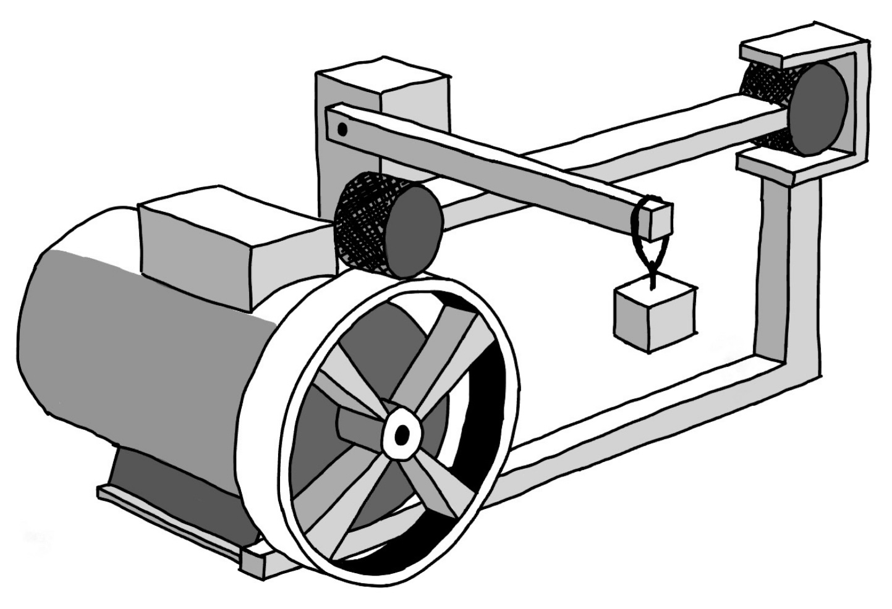
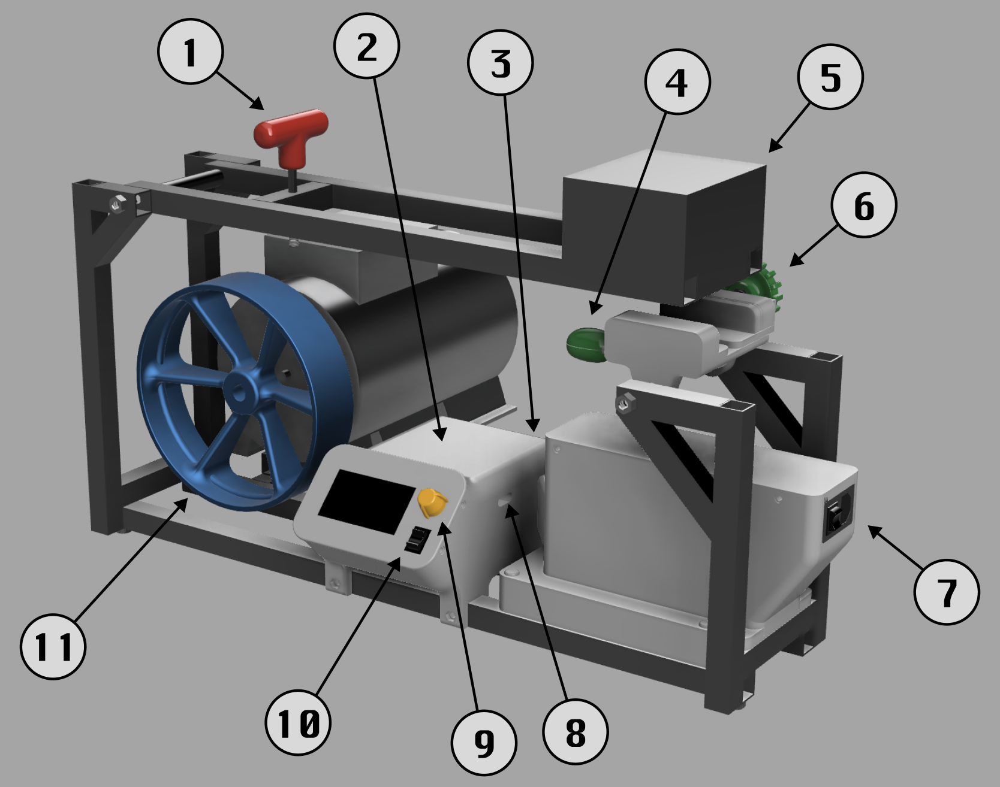
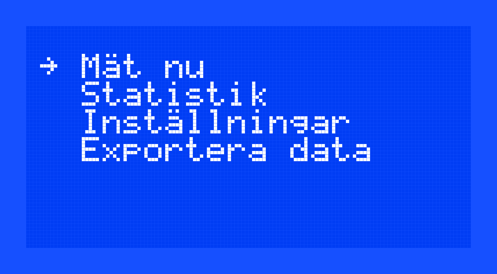
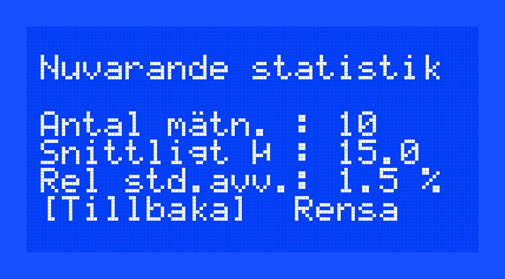
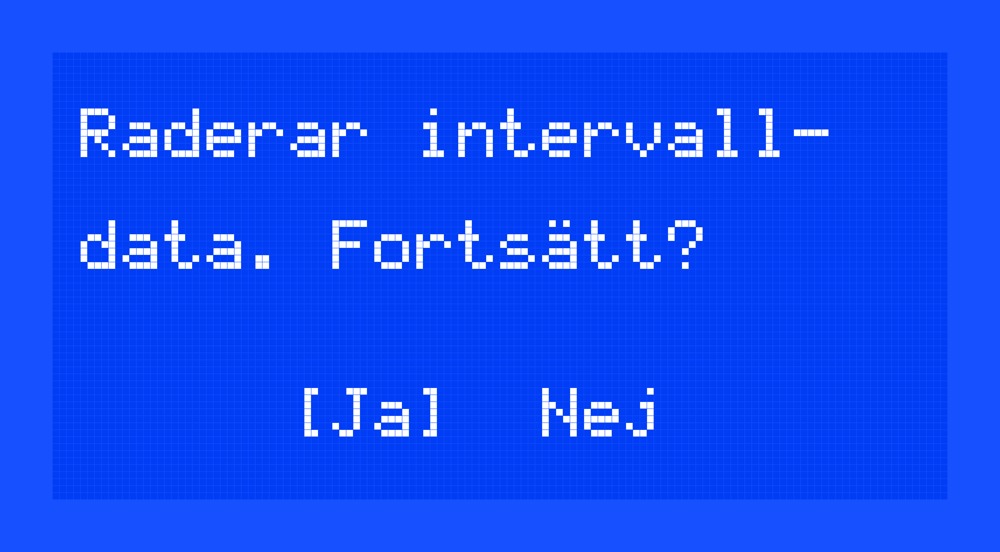
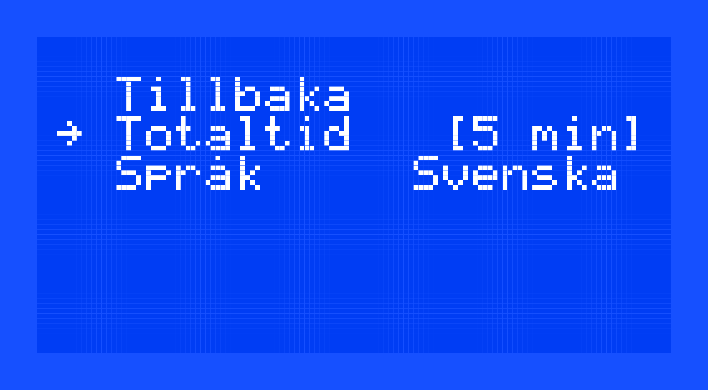
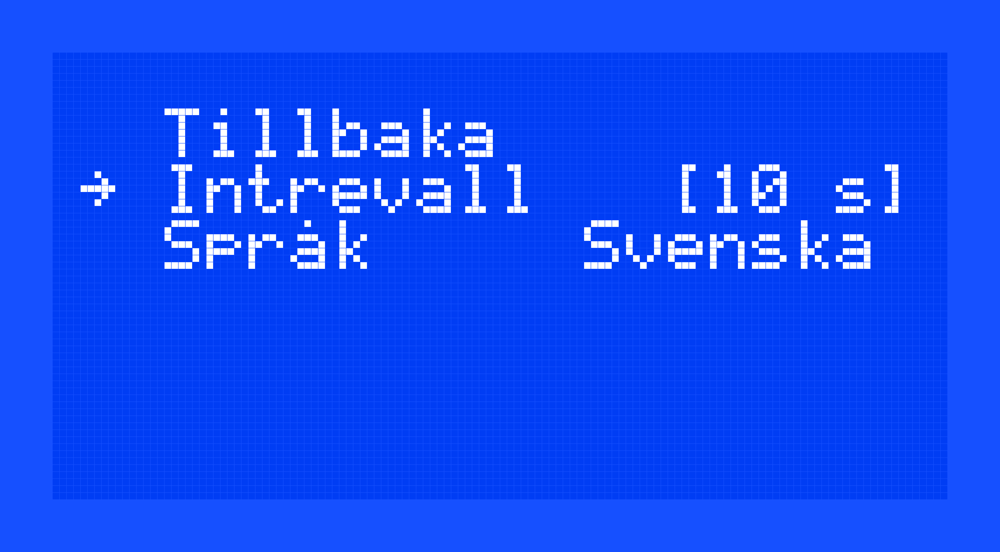

# Myskoxen 2.02

Myskoxen är ett instrument för mätning av motstånd i rullskidor som utvecklas av Friction Quantifying Systems Nordic AB. Denna handbok innehåller instruktioner för hur olika typer av mätningar kan genomföras med Myskoxen samt hur de bör analyseras. 

 

## Innehåll
1. [Förberedelser](#förberedelser)
2. [Navigera i Myskoxens menysystem](#navigera-i-myskoxens-menysystem)
3. [Utför en mätning](#utför-en-mätning)
4. [Analysera resultatet](#analysera-resultatet)
5. [Licens](#licens)

Nedan syns en karta över Myksoxen och de delar som en användare behöver bekanta sig med för att lära sig använda instrumentet.

I fortsättningen kommer Myskoxens delar markeras i text med en siffra 1 - 11 för att tydliggöra vilken del av instrumentet som avses.
 

1. Höjdskruv som kan justeras för att lastbommen ska ligga horisontellt under mätning.
2. Databoxen
3. Strömbrytare till databoxen
4. Snabbfäste: En spak som underlättar fastspänning och urtagning av en rullskida.
5. Lastbom som kan fällas upp och ner och som simulerar en åkares vikt.
6. Spänningsjusteringsskruv: Ett vred som används för att ställa in spänningen för att hålla fast en rullskida.
7. Strömingång: Här finns uttag för ström försörjning, instrumentets säkring och strömbrytare.
8. Exportuttag som används när en mätsession ska skickas till en dator för analys.
9. Menyväljare som används för att navigera i Myskoxens gränssnitt.
10. Strömbrytare till motorn
11. Svänghjul.

## Förberedelser

Myskoxen är ett elektriskt drivet instrument bestående av ett flertal tunga rörliga delar. Det är därför viktigt att instrumentet används på ett säkert sätt i samrådan med följande instruktioner. Skaparna av Myskoxen ansvarar inte för brukande av instrumentet som avviker från det som står beskrivet in denna handbok. 

### Hantering av Myskoxen 

För att dels använda Myskoxen på ett säkert sätt, dels möjliggöra så noggranna mätningar som möjligt ska instrumentet 

- placeras på ett stabilt underlag såsom en stadig arbetsbänk eller ett golv i inomhusmiljö, skyddat från vatten och andra vätskor.
- ställas på en yta som är plan och i våg. 
- användas i ett rymligt utrymme och omges av minst 50 cm av fritt luftrum år alla håll.
- endast användas i inomhusmiljö, skyddat från vatten och andra vätskor.
- inte användas som det är synilgt eller misstänkt skadat.
- kopplas till elnätet med oskadda kablar som inte utgör snubbelrisk eller risk för skada på instrumentet.
- endast användas under oavbruten uppsikt.
- inte närmas med kroppsdelar eller andra främmande objekt som kan störa instrumentet eller orsaka kollision med instrumentets rörliga delar.
- drivas endast av standardiserade uttag som levererar 230 V vid frekvensen 50 Hz.
- aldrig monteras isär eller servas av icke-licensierade tekniker.
- alltid stängas av med strömbrytaren på instrumentets högra sida. Strömkabeln får aldrig avlägsnas från instumentet när strömmen är påslagen, eftersom det kan leda till elektriska stötar.
- aldrig användas av personer som inte instruerats av en behörig operatör. I synnerhet ska instrumentet inte användas av barn.

Myskoxen är utrustad med en snabbverkande säkring (2 A) som löser ut om instumentet skulle överbelastas. Denna säkring är lättåtkomligt placerad vid instrumentets strömingång och behöver bytas ut efter att den brutits. 

## Navigera i Myskoxens menysystem

Myskoxen är utrustad med en integrerad skärm och menyväljare som tillsammans utgör hela instrumentets gränssnitt. Med hjälp av menyväljaren navigeras gränssnittet, som kan ställas in på svenska eller engelska. När databoxen startas dyker huvudmenyn upp, varifrån menyvalen 

- Mät nu
- Statistik
- Inställningar
- Exportera data

finns att välja bland. Man skrollar i menyn genom att vrida på menyväljaren. Rotation medurs skrollar nedåt och rotation moturs skrollar uppåt. Man väljer önskat menyval genom ett tryck på menyväljaren. 

   
  <em>Såhär bör huvudmenyn se ut direkt efter att databoxen slagits på.</em>

**Mät nu** startar en mätning direkt. Typen av mätning som startas kan ändras under **Inställningar**. Om typen av mätning inte ställts in, genomförs en mätning av den typ som senast ställdes in. När mätprogrammet körts klart leds du till ett val om att antingen upprepa en identisk mätning eller att returnera till huvudmenyn. Använd menyväljaren för att klicka [Upprepa] eller [Tillbaka]. 

**Statistik** leder dig till en kort tabell som översiktligt presenterar de mätningar som gjorts sedan en mätsession senast exporterades eller sedan instrumentet rensades. På tre rader visas **antalet mätningar** som gjorts, **snittfriktionen** och **den relativa standardavvikelsen** som ger ett mått på hur stor den procentuella spridningen är bland de hjul som testats. Här ges du alternativet att returnera till huvudmenyn eller rensa instrumentet. Använd menyväljaren för att klicka [Tillbaka] eller [Rensa]. Väljer du [Rensa], kommer (efter att du bekräftat valet) all data från de mätningar som sparats på instrumentet raderas.

   
  <em>Vrid menyväljaren för att ställa markören på <strong>Tillbaka</strong> eller <strong>Rensa</strong>.</em>

**Inställningar** tar dig till ytterligare en meny där två olika inställningar kan göras; **Program** och **Språk**

### Program  

Denna inställning låter dig välja mellan olika program. De tillgängliga programmen är 

- **0 s:** Mäter rullmotståndet direkt
- **30 s:** Väntar 30 sekunder och mäter sedan rullmotståndet
- **1 min:** Väntar 1 minut och mäter sedan rullmotståndet
- **5 min:** Väntar 5 minuter och mäter sedan rullmotståndet
- **10 min:** Väntar 10 minuter och mäter sedan rullmotståndet
- **20 min:** Väntar 20 minuter och mäter sedan rullmotståndet
- **Intervall:** Låter dig välja en totaltid och en intervalltid och mäter sedan automatiskt rullmotståndet så många gånger som intervalltiden får plats i totaltiden och anpassar sedan mätpunkterna till en temperaturmodell och predikterar rullmotståndets värde efter 20 minuter.

   
  <em>Om intervallprogrammet väljs dyker denna ruta upp, eftersom endast data från en typ av intervallprogram kan lagras samtidigt. Välj ja om du vill starta en mätsession med ett nytt intervallprogram.</em>

   
  <em>Skrolla i listan över totaltider för att välja intervallprogrammets längs. Klicka för att välja.</em>

   
  <em>Skrolla i listan över intervalltider för att välja mätnningarnas täthet. Klicka för att välja. Notera att intervalltiden måste vara lika lång som eller kortare än totaltiden.</em>

**Språk** Denna inställning låter dig skrolla mellan alternativen [Svenska] och [Engelska]. Välj språk genom att klicka på menyväljaren.

Skrolla upp till menyvalet [Tillbaka] för att ta dig till huvudmenyn.

**Exportera data** låter dig lagra den mätsession du tagit i en fil som kan överföras till din dator. Notera att endast en fil i taget kan exporteras. När session gjorts om till exporterbart format måste datan också exporteras till en extern dator innan en ny mätsession kan lagras som exporterbar (läs om hur en export gör i kapitlet [Analysera resultatet](#analysera-resultatet)). När en mätsession gjorts exporterbar raderas mätsessionen från gränssnittet och visas därför inte längre under sidan **Statistik**.

   
  <em>Skrolla i listan över intervalltider för att välja mätnningarnas täthet. Klicka för att välja. Notera att intervalltiden måste vara lika lång som eller kortare än totaltiden.</em>

## Utför en mätning

När Myskoxen försetts med ström, databoxen startats och ett program ställts in är instrumentet redo för mätning. En mätning genomförs på följande sätt:

1. Fäll upp lastbommen
2. För fram spaken på infästningsanordningens vänstra sida.
3. Placera en skida in Myskoxens infästningsanordning och spänn åt den med infäsningsanordningens ratt. Den behöver inte spännas hårt eftersom skidan i sidled inte kommer utsättas för krafter större än motsvarande 500 g. 
4. Se till att framhjulet vilar mot svänghjulet.
5. Skjut skidan i sidled för att säkerställa att rullskidehjulets och svänghjulets centrum ligger på en lodrät linje
6. Starta motorn med strömbrytaren på databoxen. En skida får aldrig vara unde rlastbommens tryck utan att motor är påslagen. 
7. Fäll kontrollerat ner lastbommen och justera dess läge med höjdskruven. Lastbommen ska vara horisontell när mätningen utförs
8. Klicka [Mät nu] i databoxens huvudmeny

När mätningen är över presenteras ett resultat på skärmen och alternativen att starta en identisk mätning eller returnera till huvudmenyn dyker upp. Använd menyväljaren för att klicka [Upprepa] eller [Tillbaka]. Slå av motorn och släpp infästningsanordningens spänning med spaken genom att föra den bakåt. Notera att om flera skidor med samma rambredd ska mätas räcker det att använda spaken för att fästa och släppa skidan. 

## Analysera resultatet

Efter att en mätsession avslutats och datan ska analyserats finns två alternativ; att använda Myskoxens inbyggda statistik verktyg, eller att exportera mätsessionen till en extern dator för att analysera den med hjälp av kalkylarket `Myskoxen_dataanalys.xlsx` ([Kalkylblad](https://docs.google.com/spreadsheets/d/1_fZBtHfAZzbTA4D_QNeX7JoPtTj1VCKf1J8bDB856G8/edit?usp=sharing)). För att exportera datan till kalkylbladet, följ dessa steg:

1. Förbered mätsessionen för export enligt instruktionerna i kapitltet [Navigera i Myskoxens menysystem](#navigera-i-myskoxens-menysystem).
2. Stäng av databoxen. Detta är viktigt eftersom databoxen skadas av att försörjas med ström både internt och externt. 
3. Öppna kommandotolken (Terminal på mac) på din dator.
4. Om du inte har `mpremote` installerat på din dator, kör kommandot (gäller både för kommandotolken och för Terminal)
   
       pip3 install mpremote

5. Kör kommandot

       mpremote connect auto fs cp :export.csv ~/sökväg/filnamn.csv

   på MacOS, eller

       mpremote connect auto fs cp :export.csv C:\sökväg\filnamn.csv

   på Windows.

6. Öppna [Kalkylblad](https://docs.google.com/spreadsheets/d/1_fZBtHfAZzbTA4D_QNeX7JoPtTj1VCKf1J8bDB856G8/edit?usp=sharing) i Google Kalkylark.
7. Importera mätsessionen genom att först välja [Arkiv] -> [Importera] -> [Uppladdning] -> [Bläddra]. Navigera till din exporterade fil och öppna den. Under **Importera plats** välj **Infoga nytt/nya arbetsblad** och under **Avgränsartyp** välj **Komma**. Låt boxen **Konvertera text till siffror, datum och formler** vara markerad och klicka **Importera data**. Ett nytt arbetsblad med samma namn som din fil kommer skapas i kalkylarket. Välj fliken **Summering** och ställ dig i rutan där "Data" står skrivet. Ändra texten i rutan till namnet på fliken som innehåller den mätsession du vill analysera. Notera att arbetsboken kan innehålla flera mätsessionen samtidigt och att det då går att alternera mellan dem genom att endast ändra "Data"-rutan i fliken **Summering**. 

## Licens

MIT License

Copyright (c) 2025 Albert-Hansson

Permission is hereby granted, free of charge, to any person obtaining a copy
of this software and associated documentation files (the "Software"), to deal
in the Software without restriction, including without limitation the rights
to use, copy, modify, merge, publish, distribute, sublicense, and/or sell
copies of the Software, and to permit persons to whom the Software is
furnished to do so, subject to the following conditions:

The above copyright notice and this permission notice shall be included in all
copies or substantial portions of the Software.

THE SOFTWARE IS PROVIDED "AS IS", WITHOUT WARRANTY OF ANY KIND, EXPRESS OR
IMPLIED, INCLUDING BUT NOT LIMITED TO THE WARRANTIES OF MERCHANTABILITY,
FITNESS FOR A PARTICULAR PURPOSE AND NONINFRINGEMENT. IN NO EVENT SHALL THE
AUTHORS OR COPYRIGHT HOLDERS BE LIABLE FOR ANY CLAIM, DAMAGES OR OTHER
LIABILITY, WHETHER IN AN ACTION OF CONTRACT, TORT OR OTHERWISE, ARISING FROM,
OUT OF OR IN CONNECTION WITH THE SOFTWARE OR THE USE OR OTHER DEALINGS IN THE
SOFTWARE.
